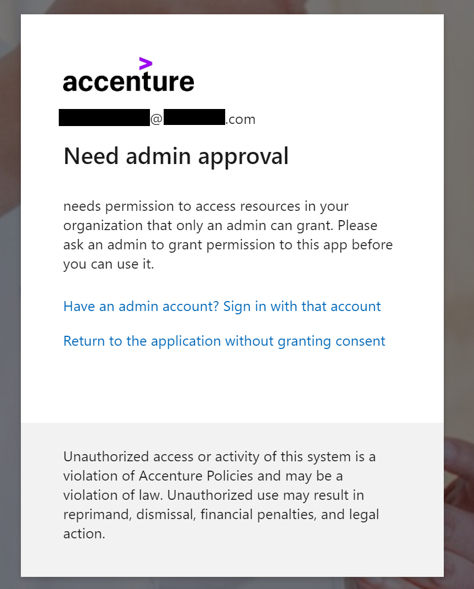
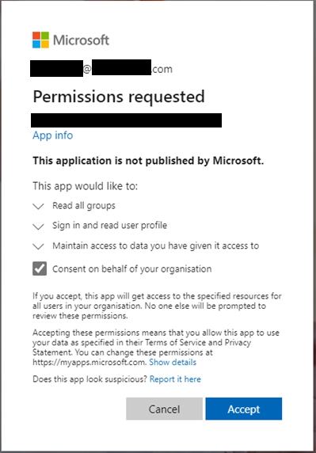

# Synchronizing user roles with Azure groups via Microsoft Graph API

If Azure groups cannot be [included in the OAuth token](Synchronizing_roles_via_OAuth2_token.md), there is an option to read them explicitly via the Microsoft Graph API, that is always available in Azure.

In this case, the Azure groups will be read via Microsoft Graph using the OAuth token provided by Azure during
initial authentication. To make this work, you need to tell the authenticator to share the token with the
connection to Microsoft Graph via `share_token_with_connections`.

To make this work, the Azure app registration must have the permission to read groups of a user:


In the workbench it is neccessary to configure the authenticator and a data connection for Microsoft Graph. The required meta objects for users and roles are already part of this app and do not need to be changed.

The meta object with objectAlias "meGroups" needs to have 4 data source settings for it it work:

```
odata_entitytype: group
odata_namespace: microsoft.graph
request_remote_pagination: true
request_offset_parameter:
```

Notice that the "request_offset_parameter" has an empty value so that it overrides the default value inside of the OData4 connector (Microsoft Graph does not accept that default value).

**IMPORTANT:** the configuration of the data connection for Microsoft Graph (client_id, secret, tenant, claims etc.)
MUST be identical with that of the authenticator!

```
 {
     "class": "\\axenox\\Microsoft365Connector\\CommonLogic\\Security\\Authenticators\\MicrosoftOAuth2Autenticator",
     "id": "AZURE_AD",
     "name": "Azure AD",
     "client_id": "552b11b2-586d-4154-a67b-c57af5a7ccce",
     "client_secret": "fx2NG7jjy0JK8_8l.G-0lXup_T9F7W_iWm",
     "tenant": "d79fb5c8-cd79-4b9e-857e-7c571213458",
     "scopes": [
         "openid", 
         "profile", 
         "email",
         "User.Read",
         "Group.Read.All"
     ],
     "create_new_users": true,
     "sync_roles_with_data_sheet": {
         "object_alias": "axenox.Microsoft365Connector.meGroups",
         "columns": [
             {
                 "attribute_alias": "displayName"
             }
         ],
         "rows_limit": "998"
     },
     "share_token_with_connections": [
         "my.App.ConnectionToMicrosoftGraph"
     ]
 }
```

The "rows_limit" set to 998 is the highest possible value for Microsoft Graph.

The column name you enter into 

```
"columns": [
             {
                 "attribute_alias": "displayName"
             }
         ]
```

will be the value that you need to add to 'Ext. role ID' when configuring the role synchronisation. In this case the Azure AD Group name will be used.

Here is an example of a corresponding connection configuration. Copy the built-in MS Graph connection
and modify its configuration to match that of the authenticator. See [Graph data connection docs](Microsoft_Graph_as_data_source.md) for more details.

```
 {
     "url": "https://graph.microsoft.com/v1.0/",
     "authentication": {
         "class": "\\axenox\\Microsoft365Connector\\DataConnectors\\Authentication\\MicrosoftOAuth2",
         "client_id": "552b11b2-586d-4154-a67b-c57af5a7ccce",
         "client_secret": "fx2NG7jjy0JK8_8l.G-0lXup_T9F7W_iWm",
         "tenant": "d79fb5c8-cd79-4b9e-857e-7c571213458",
         "scopes": [
             "openid",
             "profile",
             "email",
             "User.Read",
             "Group.Read.All"
         ]
     }
 }
```

After you have a custom MS Graph connection you need to enter the name of that connection into 

```
"share_token_with_connections": [
         "my.App.ConnectionToMicrosoftGraph"
     ]
```

You also have to edit the data source 'Microsoft Graph'. In the input for 'Custom connection' you need to add the name of the custom MS Graph connection you have just created. Otherwise the authenticator will not be able to login to Microsoft Graph.

## Troubleshooting Admin Consent

Oftentimes you will encounter the following error when trying to login after you have just setup role synchronisation via 'Group.Read.All' for the first time:



In that case a user from the customers IT support with an admin account for the azure app needs to login once to the Power UI app and approve the 'Group.Read.All' permission:

